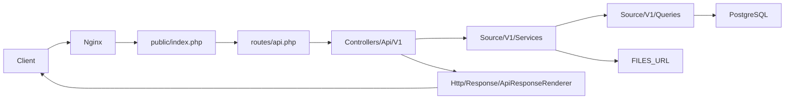

# Architektura

## Przepływ requestu



## Warstwy

### 1. Routing (`routes/api.php`)

- Prefiks Laravel `/api` + grupa `v1` → `/api/v1/...`
- Większość endpointów: `Route::match(['get', 'post'], ...)` — potwierdzone w routes
- Health: `GET /health` w `routes/web.php`

Identyfikatory w routes:

| Parametr | Regex | Uwagi |
|----------|-------|-------|
| `{caseUid}` | `[a-f0-9]{13}` | |
| `{documentId}` | `(\d+\|[a-f0-9]{13})` | @TODO: docelowo numeric `instanceId` |
| `{attachmentUid}` | `[a-f0-9]{13}` | |

### 2. Kontrolery (`app/Http/Controllers/Api/V1/`)

| Kontroler | Serwis | Uwagi |
|-----------|--------|-------|
| `CasesController` | `CaseService` | `dntas = 0` |
| `DntasController` | `CaseService` | `dntas = 1`, `AbstractCaseController` |
| `DocumentsController` | `DocumentService` | |
| `AttachmentController` | `AttachmentService` | binary stream (pojedynczy załącznik) |
| `WorkstationsController` | `WorkstationService` | tylko GET |

### 3. Request DTO (`app/Source/V1/DTO/Request/`)

Kontrolery przekazują `$request->all()` do fabryk `fromPayload` / `fromArray`.

| DTO | Rola |
|-----|------|
| `KryteriaWyszukiwaniaSpraw` | `filtry`, `konfiguracja`, `sort`, paginacja, `dntas` |
| `KryteriaWyszukiwaniaDokumentow` | analogicznie dla dokumentów |
| `TypFiltrSpraw` | extends `TypFiltrDokument` + pola specyficzne dla spraw |
| `TypFiltrDokument` | mapowanie snake_case z JSON |
| `ApiKonfiguracja` | `madkomWorkstationIds`; `einstytucjaUserId` — **parsowane, niewykorzystywane** w Services/Queries |
| `Paginacja` | default limit 10, max 200 |
| `SortowanieSpraw` / `SortowanieDokumentow` | whitelist pól → ORDER BY SQL |

Walidacja ręczna w DTO. `SearchRequest` istnieje, **nie jest podpięty** do tras (Q-17).

### 4. Serwisy

Orkiestracja: Queries → mapowanie DTO → wywołania innych serwisów.

Zależności `CaseService` (konstruktor): `CaseListQuery`, `CaseQuery`, `FormQuery`, `WorkstationQuery`, `UugQuery`, `DocumentService`, `FormService`, `AttachmentService`, `SupliantService`, `CaseHistoryService`.

### 5. Queries

Szczegóły: [queries/README.md](queries/README.md).

### 6. Response (`app/Http/Response/`)

Envelope z `AbstractFormatter::normalize()` — pola faktycznie zwracane:

```json
{
  "success": true,
  "status_code": 200,
  "message": "...",
  "meta": { "page": 1, "limit": 10, "count": 42 },
  "data": []
}
```

- `message` — tylko gdy nie-null
- `error` — **tylko przy błędzie** (`success: false`), wartość = `errorCode` z `ApiResponse`
- `meta` — tylko gdy niepusta

Format: `?format=json|xml|html` (domyślnie JSON). Obsługiwane formaty: `FormatterFactory` — json, xml, html.

### 7. Wyjątki

`ApiExceptionRenderer`: `RuntimeException` → 404, `Exception` → 422, `NotFoundHttpException` → 404, inne → 500.

## Middleware

| Middleware | Rola |
|------------|------|
| `ApiAccessLogMiddleware` | logowanie dostępu API |

Brak auth middleware w kodzie.

## Console / scheduler

`routes/console.php` — `attachments:test-main-document-attachments-exists` (schedule: codziennie 02:00).

## Konfiguracja

| Plik | Ustawienia |
|------|------------|
| `config/app.php` | locale `pl`, timezone `Europe/Warsaw` |
| `config/database.php` | `pgsql` |
| `.env.example` | `DB_*`, `FILES_URL`, `CACHE_STORE=array` |
| `docker-compose.yml` | `FILES` mount `:ro`, postgres:16, port 8080 |

## Poza aplikacją

Import dumpa: `scripts/import-db.sh`, `scripts/import-to-pg_import.sh`.

## Otwarte kwestie

Pełna lista: [open-questions.md](open-questions.md).
