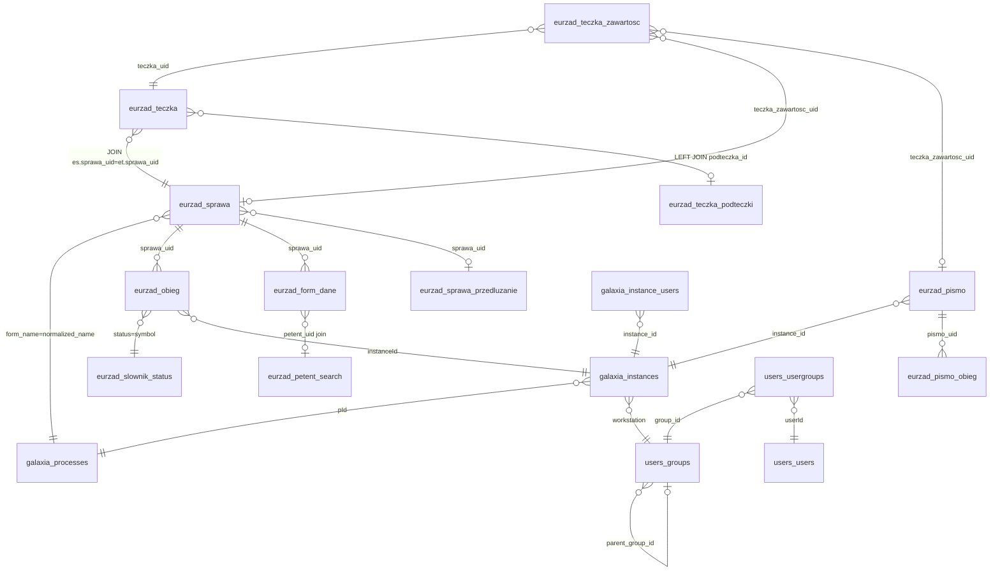

# Baza danych — schemat legacy EZD

Schemat PostgreSQL **nie jest definiowany w repozytorium**. Pochodzi z dumpa EZD (`scripts/`).

Opis poniżej oparty na odwołaniach w `app/Source/V1/Queries/`. **Brak DDL w repo.**

## Konwencje identyfikatorów

| Typ | Format w kodzie | Gdzie |
|-----|-----------------|-------|
| UID teczki / `{caseUid}` | hex 13 znaków | `routes/api.php`, `TypFiltrSpraw` |
| UID pisma wiodącego | hex 13 znaków | `eurzad_sprawa.sprawa_uid` |
| UID dokumentu w sprawie | hex 13 znaków | `eurzad_pismo.pismo_uid` |
| `{documentId}` w routes | `\d+` **lub** hex 13 | @TODO → tylko `instanceId` |
| Instance workflow | integer | `galaxia_instances."instanceId"` |
| Stanowisko | integer | `galaxia_instances.workstation` = `users_groups.group_id` |

## Model koncepcyjny

**Cardinality w diagramie: WNIOSEK Z SQL (JOIN-y w Queries), NIE Z DDL.** Rzeczywiste PK/FK mogą się różnić.



**Hub w SQL:** `eurzad_sprawa` (pismo wiodące) — workflow, formularze, powiązanie z teczką.

**Dokumenty w sprawie:** `eurzad_pismo` + `eurzad_pismo_obieg` — osobna ścieżka w DocumentListQuery typ 2.

## Słownik tabel

Kolumny = te używane w Queries. Pełny DDL poza repo.

### Sprawy i teczki

| Tabela | Alias | Rola w SQL | Kolumny z kodu |
|--------|-------|------------|----------------|
| `eurzad_teczka` | `et`, `t` | Punkt startu CaseListQuery; opcjonalnie w DocumentListQuery | `teczka_uid`, `sprawa_uid`, `teczka_znak_sprawy`, `teczka_createdate`, `teczka_rok_zalozenia`, `tytul_sprawy`, `opis_sprawy`, `oznaczenie_dntas`, `dntas`, `podteczka_id` |
| `eurzad_teczka_podteczki` | `tp` | LEFT JOIN w CaseQuery | `id`, `opis` |
| `eurzad_teczka_zawartosc` | `tz`, `etz` | Powiązanie zawartości teczki | `teczka_uid`, `teczka_zawartosc_uid` |
| `eurzad_sprawa` | `es`, `sp` | Pismo wiodące; start DocumentListQuery typ 1/3/4 | `sprawa_uid`, `form_name`, `sprawa_createdate` |
| `eurzad_sprawa_przedluzanie` | `esp`, `sp` | Daty w SELECT (kolumny: `sprawa_createdate`, `czas_realizacji`) | `sprawa_uid` |
| `eurzad_obieg` | `eo`, `o` | Obieg sprawy | `sprawa_uid`, `instanceId`, `status`, `status_sprawy_id`, `max_status_sprawy_id`, `uugid_from`, `uugid_to`, `createdate`, `added_automatically` |

### Dokumenty w sprawie

| Tabela | Alias | Rola | Kolumny |
|--------|-------|------|---------|
| `eurzad_pismo` | `ep`, `p` | Start DocumentListQuery typ 2 | `pismo_uid`, `instance_id`, `pismo_createdate`, `pismo_wersja`, `id` |
| `eurzad_pismo_obieg` | `epo`, `po` | Obieg pisma | `pismo_uid`, `pismo_obieg_id`, `status`, `uugid_from`, `uugid_to`, `createdate` |

### Formularze

| Tabela | Alias | Rola |
|--------|-------|------|
| `eurzad_form_dane` | `fd_*` | Pola pisma wiodącego (`form_dane_pole`, `form_dane_wartosc`) |
| `eurzad_form_struktura` | `fs` | Definicja pól (`FormQuery`) |
| `eurzad_form_pisma_dane` | `fdp` | Pola pisma (`klucz`, `wartosc`, join po `ep.id`) |

Pola używane w Queries: `petent_uid`, `interesanci`, `pliki`, `dokument_tytul`, `tresc_wniosku`, `nr_na_pismie`, `data`.

### Interesanci, workflow, reszta

Patrz macierz poniżej. `eurzad_petent_search.view_all` — używane w SuppliantQuery (poza Fazą 1 docs).

Filtr zwrotów (DocumentListQuery): `gp.name IN ('zwrot', 'zwrotka')` vs `NOT IN` — wartości z kodu SQL.

## Macierz: tabela → Query class

| Tabela | Query classes |
|--------|---------------|
| `eurzad_teczka` | CaseListQuery, CaseQuery, DocumentListQuery |
| `eurzad_teczka_podteczki` | CaseQuery |
| `eurzad_teczka_zawartosc` | CaseQuery, DocumentListQuery |
| `eurzad_sprawa` | CaseListQuery, DocumentListQuery, DocumentQuery, FormQuery |
| `eurzad_sprawa_przedluzanie` | CaseListQuery, DocumentListQuery |
| `eurzad_obieg` | CaseListQuery, CaseQuery, DocumentListQuery, DocumentQuery, ProcessQuery |
| `eurzad_pismo` | DocumentListQuery, DocumentQuery, FormQuery |
| `eurzad_pismo_obieg` | DocumentListQuery, DocumentQuery |
| `eurzad_form_dane` | CaseListQuery, DocumentListQuery, FormQuery, SuppliantQuery |
| `eurzad_form_struktura` | FormQuery |
| `eurzad_form_pisma_dane` | DocumentListQuery, FormQuery |
| `eurzad_petent_search` | CaseListQuery, DocumentListQuery, SuppliantQuery |
| `eurzad_petent_dane` | CaseListQuery, DocumentListQuery |
| `eurzad_petent_roles` | SuppliantQuery |
| `eurzad_zalacznik` | AttachmentQuery |
| `eurzad_ksiega` / `eurzad_ksiega_sprawa` | DocumentListQuery |
| `eurzad_slownik_status` | CaseListQuery, CaseQuery, DocumentListQuery, DocumentQuery |
| `eurzad_dictionary_content` | DoctionaryQuery |
| `galaxia_processes` | CaseListQuery, DocumentListQuery, DocumentQuery, FormQuery, ProcessQuery |
| `galaxia_instances` | CaseListQuery, CaseQuery, DocumentListQuery, DocumentQuery, FormQuery, ProcessQuery |
| `galaxia_instance_users` | AbstractDocumentQuery, CaseListQuery, DocumentQuery |
| `users_groups` | CaseListQuery, DocumentListQuery, GroupQuery, WorkstationQuery |
| `users_usergroups` | CaseListQuery, DocumentListQuery, WorkstationQuery, UugQuery |
| `users_users` | CaseListQuery, DocumentListQuery, UugQuery, WorkstationQuery |

## Łańcuchy JOIN — CaseListQuery vs DocumentListQuery

### A. CaseListQuery — start: `eurzad_teczka et`

```sql
FROM eurzad_teczka et
INNER JOIN eurzad_sprawa es ON es.sprawa_uid = et.sprawa_uid
-- dalej: gp, eo (max_status_sprawy_id > 0), ess, gi, esp, users_*
-- LEFT JOIN: fd_petent, pd_petent, ps_petent, fd_pliki (w getList)
```

Filtr DNTAS: `et.dntas = {0|1}`.

### B. DocumentListQuery typ 1, 3, 4 — start: `eurzad_sprawa es`

Ten sam rdzeń co A **bez** `eurzad_teczka` w FROM — teczka dołączana osobno:

| Typ | JOIN teczki |
|-----|-------------|
| 1 (wiodące) | `et ON es.sprawa_uid = et.sprawa_uid` |
| 3 (inicjujące w sprawie) | via `teczka_zawartosc`: `etz.teczka_zawartosc_uid = es.sprawa_uid` |
| 4 (zwroty / potwierdzenia odbioru) | podwójny self-join `teczka_zawartosc` — szczegóły: [queries/document-queries.md#potwierdzenia-odbioru--zwrotki-typ-4](queries/document-queries.md#potwierdzenia-odbioru--zwrotki-typ-4) |

Dodatkowo: filtr procesu `gp.name NOT IN / IN ('zwrot', 'zwrotka')`. Zwrotki to wiersze `eurzad_sprawa` (nie `eurzad_pismo`); powiązanie z dokumentem w sprawie jest pośrednie przez hierarchię `teczka_zawartosc` (Q-06).

### C. DocumentListQuery typ 2 — start: `eurzad_pismo ep`

```sql
FROM eurzad_pismo ep
INNER JOIN galaxia_instances gi ON gi."instanceId" = ep.instance_id
INNER JOIN LATERAL ( ... eurzad_pismo_obieg ... LIMIT 1) epo ON true
-- commonInnerJoinSql (users_*)
-- teczka: etz.teczka_zawartosc_uid = ep.pismo_uid → et
```

**Brak** `eurzad_sprawa` / `eurzad_obieg` w tej gałęzi — inny model obiegu niż pisma wiodące.

### Wspólny fragment (A i B) — po `es`

```sql
INNER JOIN galaxia_processes gp ON gp.normalized_name = es.form_name
INNER JOIN eurzad_obieg eo ON (eo.sprawa_uid = es.sprawa_uid AND eo.max_status_sprawy_id > 0)
INNER JOIN eurzad_slownik_status ess ON ess.symbol = eo.status
INNER JOIN galaxia_instances gi ON gi."instanceId" = eo."instanceId"
INNER JOIN eurzad_sprawa_przedluzanie esp ON esp.sprawa_uid = es.sprawa_uid
INNER JOIN users_groups ug_w ON ug_w.group_id = gi.workstation
-- ... uug (status='A', typ='Z'), uu
```

### Interesant (LEFT JOIN — gałęzie es)

```sql
LEFT JOIN eurzad_form_dane fd_petent ON ... form_dane_pole = 'petent_uid'
LEFT JOIN eurzad_petent_dane pd_petent ON ...
LEFT JOIN eurzad_petent_search ps_petent ON ...
```

## Pułapki (potwierdzone / otwarte)

| Problem | Gdzie | Status |
|---------|-------|--------|
| Niespójność `max_status_sprawy_id` vs `status_sprawy_id` | CaseListQuery vs CaseQuery | Q-01 |
| Duplikat JOIN `eurzad_sprawa_przedluzanie` | DocumentListQuery `pismoInnerJoinsSql` | Q-07 |
| `ProcessQuery` bez konsumenta w Services | grep | Q-05 |
| `Document/QueryBuilder.php` | glob/IDE vs brak pliku na dysku | Q-04 |
| Historyczne duplikaty `max_status_sprawy_id` | komentarz w CaseListQuery | naprawa danych poza API |

## Powiązana dokumentacja

- [queries/case-queries.md](queries/case-queries.md)
- [queries/document-queries.md](queries/document-queries.md)
- [open-questions.md](open-questions.md)
